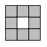
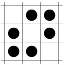
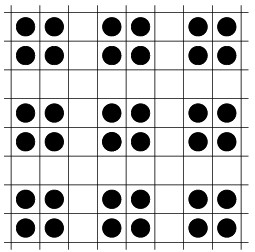

Title:    Maximum density still life
Proposer: Barbara Smith
Category: None

This problem arises from the Game of Life, invented by John Horton Conway in the 1960s and popularized by Martin Gardner in his
Scientific American columns.

Life is played on a squared board, considered to extend to infinity in all directions. Each square of the board is a cell, which at any time during the game is either alive or dead. A cell has eight neighbours:

The configuration of live and dead cells at time *t* leads to a new configuration at time *t+1* according to the rules of the game:

- if a cell has exactly three living neighbours at time *t*, it is alive at time *t+1*
- if a cell has exactly two living neighbours at time *t* it is in the same state at time *t+1* as it was at time *t*
- otherwise, the cell is dead at time *t+1*

A stable pattern, or *still-life*, is not changed by these rules. Hence, every cell that has exactly three live neighbours is alive, and every cell that has fewer than two or more than three live neighbours is dead. (An empty board is a still-life, for instance.)

What is the densest possible still-life pattern, i.e. the pattern with the largest number of live cells, that can be fitted into an *n* x *n* section of the board, with all the rest of the board dead?

(Note that another definition of a still-life requires the pattern to be a single *object* - see for instance [Mark Niemiec's Definitions of Life Terms](http://home.interserv.com/~mniemiec/lifeterm.htm) page.
On this definition, the 8 x 8 pattern below is a *pseudo still-life*.)

### Examples of  optimal solutions

A 3 x 3 still-life with 6 live cells and an 8 x 8 still-life with 36 live cells.

