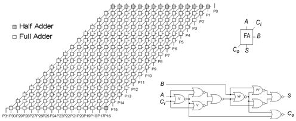

### A problem instance

The *c6288* digital circuit from the ISCAS-85 set of benchmarks is a 16-bit multiplier, which can be seen as a grid-like pattern of 240 half and full adders (as in Figure below) consisting of 2406 logical gates in all.

    

High-level model of c6288 Multiplier Circuit and full adder module (images obtained from  http://www.eecs.umich.edu/~jhayes/iscas/).

*C6288* is of special interest in that it has traditionally proven difficult to  diagnosis system.

This diagnosis problem uses input vector  `01001000000100010001000110100000`, corresponding to the multiplication of `34834` by `1416`, returning `49324944`, represented in binary by (least significant bit  first) `00001001110001010000111101000000`. From this correct output, a bit at a  time is flipped, obtaining `32` incorrect output vectors. For each such incorrect output vector, the goal is to find the set of all single faults that explain it.

Additionally, as a harder problem, the goal is extended to find the set of all  double faults that explain it.

Circuit description (taken from http://www.eecs.umich.edu/~jhayes/iscas/ ) can be seen [here](../assets/c6288.txt).

The problem is also described in: "José Júlio Alferes, Francisco Azevedo, Pedro Barahona, Carlos V. Damasio and  Terrance Swift, *Deductive Diagnosis of Digital Circuits*, in First IFIP  Conference on Artificial Intelligence Applications and Innovations (AIAI'2004),  Kluwer Academic Press, pages 155-165, 2004." where some results are presented.
