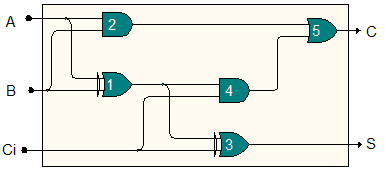

When the output of some system does not correspond to its expected behaviour for  a given input, one is faced with the problem of diagnosis. We are particularly  concerned with digital circuits where only the circuits input and output may be  observed.

Given a set of possible faults, we want to differentiate them in order to find  the real one affecting the circuit. For that, we may perform pairwise  differentiations between 2 diagnoses (2 sets of faults - usually 2 single  faults) _d1_,_d2_, by generating an input vector  _Id1,d2_ that would entail an output  vector _Od1_ under diagnosis _d1_ (i.e. with faults _d1_ really present in the  circuit), and an output vector _Od2_ under diagnosis _d2_, with _Od1_ different than _Od2_. Applying such input _Id1,d2_ to the circuit, at least one of the 2 diagnoses  will be discarded by checking the output.

Differential diagnosis thus consists in finding such a differentiating test  vector, or concluding that none exists (in which case we say that the two  diagnoses are indistinguishable).
(As usual, faulty circuit gates are either _stuck-at-0 _or _stuck-at-1_,  respectively outputting value 0 or 1 independently of the input.)

In the example adder circuit below, to differentiate candidate faults _Gate1  stuck-at-1_ and _Gate3 stuck-at-1_, a possible input test vector is , since  with _Gate1 stuck-at-1_ the output would be  $(S=0,C=1)$, whereas with  _Gate3  stuck-at-1 _the output would be  (the same as without faults).

