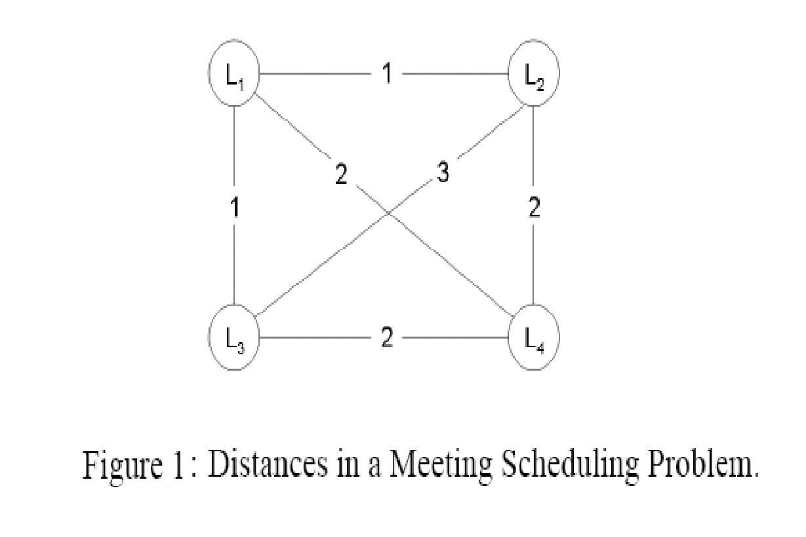
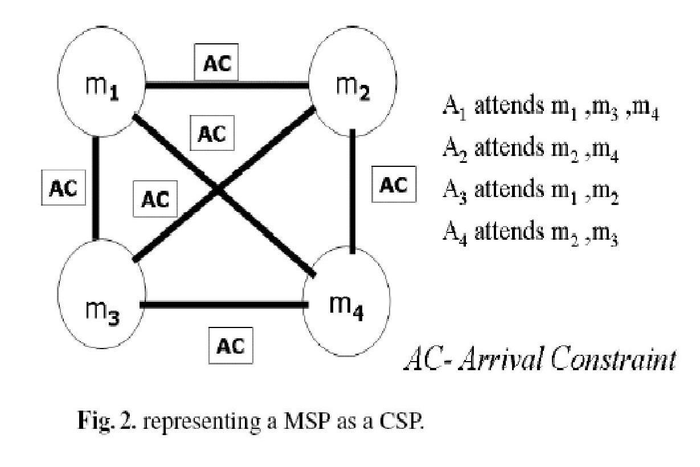
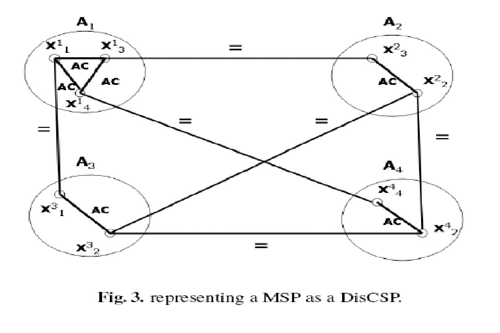

Title: Meeting Scheduling   
Proposer: Uri Shapen, Roie Zivan and Amnon Meisels
Category: Distributed CSP,
          Scheduling and related problems

Meeting scheduling is a well-known, recurrent and easily described problem.
The meeting scheduling problem (MSP) will be described below as a centralistic
constraints satisfaction problem (CSP).

However, one of its most interesting features is the fact that it is a
Distributed CSP. Informally, a set of agents want to meet and they search for
a feasible meeting time that satisfies the private constraints of each of the
agents and in addition satisfies arrival-time constraints
(among different meetings of the same agent).

*The general definition of the MSP family is as follows:*

- A group $S$ of $m$ agents
- A set $T$ of $n$ meetings
- The duration of each meeting $m_i$ is $\rm{duration}_i$
- Each meeting $m_i$ is associated with a set $s_i$ of agents in $S$, that attend it
- Consequently, each agent has a set of meetings that it must attend
- Each meeting is associated with a location
- The scheduled time-slots for meetings in $T$ must enable the participating
agents to travel among their meetings

The table below presents an example of a MSP, including the traveling time
in time-units (say, hours) between different meeting locations.

| Meeting | Location | Attending agents |
| :-----: | :------: | :--------------: |
| $m_1$   | $L_1$    | $A_1, A_3$       |
| $m_2$   | $L_2$    | $A_2, A_3, A_4$  |
| $m_3$   | $L_3$    | $A_1, A_4$       |
| $m_4$   | $L_4$    | $A_1, A_2$       |

The distances (in time-slots) between the meetings are described by the
following:

*The meeting scheduling problem as described above can be naturally
represented as a constraints satisfaction problem (CSP) in the following way:*

- A set of variables $T$ - $m_1, m_2,\ldots ,m_n$ - the meetings to be scheduled
- Domains of values $D$ - all weekly time-slots
- A set of constraints $C$ - for every pair of meetings $m_i,$m_j$ there is an
arrival-time constraint, if there is an agent that participates in both
meetings. Private meetings are equivalent to unary constraints that remove
values from domains of some meetings. Since all agents have the same
arrival-times between any two locations, there is only one type of
arrival-time binary constraint.

The arrival-time constraint - given two time-slots $t_i, t_j$ there is a conflict
if 

$$|\rm{time}(t_i)-\rm{time}(t_j)|- \rm{duration}_i < \rm{TravellingTime}(\rm{location}(m_i),
\rm{location}(m_i))$$

Simplifying assumptions:

- All agents have the same size of weekly calendar - $M$ time-slots
- All Meetings have the same duration and it's 1 time-slot.
- Each agent attends the same number of meetings

The Density of the CSP network depends on the number of meetings ($m$), 
the number of agents ($n$) and the number of meetings per agent ($k$).
The Tightness of a constraint depends on the domain size of the meetings 
and the locations of the two constrained meetings. The Density and Tightness
can be calculated in the following way:

Density $(p_1)$ - the ratio of the total number of edges to the maximal
number of possible edges. 

$$p_1 = \rm{edges in the network}/(m\*(m - 1)/2)$$

Tightness $(p_2)$ - the ratio between the total number of eliminated time
slots to the number of total tuples ($D^2$). Therefore $p_2$ is defined as  

$$p_2 = (D\*(2\*s + 1) - s^2)/(D\*D)$$

where $s$ is the travelling time between the meeting locations.

A Representation of a Meeting Scheduling Problem as CSP is described in 
Figure 2:

The meeting scheduling problem is naturally described as a Distributed CSP.
The representation of the MSP as DisCSP is based on the distributed nature 
of the problem. The MSP is a distributed negotiation problem between different
users. Therefore, the agents are associated with the users and not with the
meetings. The meetings are the variables that must be assigned time slots and
they are duplicated within all agents that attend the same meeting.

*The MSP can be represented as DisCSP in the following way:*

- Agents - the Group $S$ of agents
- For each Agent $s_i$ in $S$ there is a variable $x_{ij}$, for every 
meeting $m_j$ that $s_i$ attends.
- Each agent $s_i$ includes arrival-time constraint between every pair of its
local variables $x_{ij}, x_{ik}$.
- For every pair of agents $s_i, s_j$ that attend meeting $m_k$ there is an
equality inter-agent constraint between the variables $x_{ik}, x_{jk}$,
corresponding to the meeting $m_k$.

A Representation of a Meeting Scheduling Problem as DisCSP is described in
Figure 3.

*Random Meeting Scheduling Problem (RMSP) specification:*

The RMSP can be parameterized in many ways. Parameters can be the number of meetings,
locations, number of agents, etc. 

Let us first denote the set of all parameters:

- number of meetings - $m$
- number of agents - $n$
- number of meetings per agent - $k$
- distances between locations of meetings - in units of time slots
- domain size - number of time-slots - $l$ 

The meetings are the set of $m$ variables of the constraints network, each
representing a meeting at a specific location. The domains of values are the
time-slots $l$. An edge between any pair of variables represents an agent 
that participates in both meetings. The density of the constraints network is
a function of the number of edges in the network. The number of edges in the
network depends on the number of agents and the distribution of meetings
that each agent attends. 

If each agent participates in $k$ meetings, we generate the resulting CSP
as follows: 

For each of the $n$ agents a clique of $k$ variables (meetings) is selected 
randomly, such that not all of the edges of the clique are already in the
network. All the edges of the generated clique are added to the CSP network,
representing  the arrival-time constraints between the meetings of each agent. 
The arrival-time between each two meetings is also randomly generated. Note,
that an agent $A_i$ adds an arrival-constraint between meetings $m_j, m_k$
only if there is no other agent that attends both meetings. Two agents or
more that participate in $m_j, m_k$ define only one arrival-constraint. 
The distance between locations of meetings randomly generated according to
the given range (between the minimal meeting distance and the maximal one).

Below is an example of a randomly generated Meeting Scheduling Problem:

- NumberOfMeetings    = 5
- NumberOfAgents = 3
- NumberOfMeetingPerAgent = 3
- MinDisTimeBetweenMeetings = 1
- MaxDisTimeBetweenMeetings = 3
- DomainSize		   = 6

Meetings are $m_1, m_2, m_3, m_4, m_5$

Agents are $a_1, a_2, a_3$

Agents' Meetings:

Agent (0): $m_1, m_3, m_5$  
Agent (1): $m_1, m_2, m_3$  
Agent (2): $m_2, m_3, m_4$

Distances between Meeting Locations:

|   | 1	| 2 | 3	| 4	| 5 |
|---|---|---|---|---|---|
| 1:| 0 | 1	| 2	| 1	| 3 |
| 2:| 1	| 0	| 3	| 2	| 2 |
| 3:| 2	| 3	| 0	| 1	| 2 |
| 4:| 1 | 2 | 1 | 0	| 3 |
| 5:| 3 | 2 | 2 | 3	| 0 |
