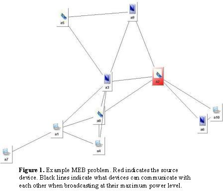
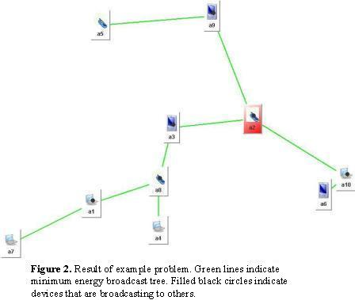

### Overview

This benchmark specification originates from the Centre for Telecommunications Value-chain Research and Cork Constraint Computation Centre, Dept. of Computer Science, University College Cork, Ireland. This work is supported by Science Foundation Ireland under Grant No. 03/CE3/I405.

An ad hoc network is a collection of wireless devices that form a network without any centralised infrastructure. When the devices are deployed they must first configure themselves to form a correctly functioning network. One configuration task when operating in a battery limited environment is the Minimum Energy Broadcast (MEB) problem. Assume a network of devices with omnidirectional antennas. The aim is to configure the power level in each device such that if a specified source device broadcasts a message it will reach every other device either directly or by being retransmitted by an intermediate device (a broadcast tree is formed). The desired configuration is that which minimises the total energy required by all devices, thus increasing the lifetime of the network.

Several approaches (both centralised and distributed) have been proposed for solving this problem. See the references page of this benchmark for more information. As there is no central controller and in a large network centralising the entire problem may be infeasible, Distributed Constraint Optimisation (DisCOP) is one appropriate way to model and solve the problem, and it is this approach that will be described in this specification.

### Distributed COP Formulation

To formulate the problem as a Distributed COP, we have an agent, *ai*, representing each device in the network. The neighbours of *ai* include all agents that *ai* can communicate with when broadcasting at its maximum power level.

**Relationship variables:** For each neighbour *aj*, *ai* has a public variable, taking one of 3 values, indicating the relationship between the two devices in the current solution (broadcast tree):

-   0 = the devices are not connected in the broadcast tree
-   1 = *ai* is the parent of *aj* in the broadcast tree
-   2 = *ai* is the child of *aj* in the broadcast tree

An inter-agent constraint between each pair of neighbours ensures that the corresponding variables in neighbouring nodes match up correctly, i.e. both are 0, or else one is 1 and the other is 2. To construct a tree, each agent is constrained to have exactly one parent, except the source device, which is not allowed any parents.

**Power/energy variables:** The agents also have a private variable corresponding to each of these public variables set to be the energy cost incurred due to the setting of that public variable, i.e. if the public variable is 1 then the private variable is assigned the energy cost for broadcasting to that neighbour, otherwise it is assigned 0. A private constraint over all of these 'energy cost' variables states the total cost for *ai* to broadcast to all of its children is the *maximum* of these costs.

**Hop-count variable:** Each agent also has a hop-count variable, indicating how many hops that device is from the source device. A second inter-agent constraint between neighbouring agents ensures that the hop-count of a child in the broadcast tree is one greater than its parent, thus preventing cycles.

### Example

Figure 1 displays an example MEB problem with 10 devices. This problem is modelled using the variables as specified in Table 1 and constraints as described in the previous paragraph. Its corresponding minimal energy broadcast tree is shown in Figure 2, and the optimal assignments to variables is shown in Table 2.

    
    

<table border="">
  <caption align="LEFT"><b>Table 1.</b> Complete list of variables and domains of all agents in the problem.
    Variable names begin with the agent name. Subscript 'h' indicates hop count variable; 'r' indicates relationship variable; 'p' indicates broadcast power/energy cost variable. For relationship variables, -x indicates that variable is for the relationship with agent x. Similarly for energy cost variables, the -x indicates that this is the power required to reach agent x. 
  </caption>
  <tbody>
    <tr>
      <td> Variable </td>
      <td> a1h </td>
      <td> a1r-3 </td>
      <td> a1p-3 </td>
      <td> a1r-4 </td>
      <td> a1p-4 </td>
      <td> a1r-7 </td>
      <td> a1p-7 </td>
      <td> a1r-8 </td>
      <td> a1p-8</td>
    </tr>
    <tr>
      <td> Domain </td>
      <td> 0-9 </td>
      <td> 0,1,2 </td>
      <td> 0,93 </td>
      <td> 0,1,2 </td>
      <td> 0,21 </td>
      <td> 0,1,2 </td>
      <td> 0,48 </td>
      <td> 0,1,2 </td>
      <td> 0,17</td>
    </tr>
    <tr>
      <td> Variable </td>
      <td> a2h </td>
      <td> a2r-3 </td>
      <td> a2p-3 </td>
      <td> a2r-6 </td>
      <td> a2p-6 </td>
      <td> a2r-8 </td>
      <td> a2p-8 </td>
      <td> a2r-9 </td>
      <td> a2p-9 </td>
      <td> a2r-10 </td>
      <td> a2p-10</td>
    </tr>
    <tr>
      <td> Domain </td>
      <td> 0-9 </td>
      <td> 0,1,2 </td>
      <td> 0,33 </td>
      <td> 0,1,2 </td>
      <td> 0,97 </td>
      <td> 0,1,2 </td>
      <td> 0,107 </td>
      <td> 0,1,2 </td>
      <td> 0,93 </td>
      <td> 0,1,2 </td>
      <td> 0,93</td>
    </tr>
    <tr>
      <td> Variable </td>
      <td> a3h </td>
      <td> a3r-1 </td>
      <td> a3p-1 </td>
      <td> a3r-2 </td>
      <td> a3p-2 </td>
      <td> a3r-4 </td>
      <td> a3p-4 </td>
      <td> a3r-5 </td>
      <td> a3p-5 </td>
      <td> a3r-8 </td>
      <td> a3p-8 </td>
      <td> a3r-9 </td>
      <td> a3p-9</td>
    </tr>
    <tr>
      <td> Domain </td>
      <td> 0-9 </td>
      <td> 0,1,2 </td>
      <td> 0,93 </td>
      <td> 0,1,2 </td>
      <td> 0,33 </td>
      <td> 0,1,2 </td>
      <td> 0,79 </td>
      <td> 0,1,2 </td>
      <td> 0,162 </td>
      <td> 0,1,2 </td>
      <td> 0,7 </td>
      <td> 0,1,2 </td>
      <td> 0,124</td>
    </tr>
    <tr>
      <td> Variable </td>
      <td> a4h </td>
      <td> a4r-1 </td>
      <td> a4p-1 </td>
      <td> a4r-3 </td>
      <td> a4p-3 </td>
      <td> a4r-8 </td>
      <td> a4p-8</td>
    </tr>
    <tr>
      <td> Domain </td>
      <td> 0-9 </td>
      <td> 0,1,2 </td>
      <td> 0,21 </td>
      <td> 0,1,2 </td>
      <td> 0,79 </td>
      <td> 0,1,2 </td>
      <td> 0,5</td>
    </tr>
    <tr>
      <td> Variable </td>
      <td> a5h </td>
      <td> a5r-3 </td>
      <td> a5p-3 </td>
      <td> a5r-9 </td>
      <td> a5p-9</td>
    </tr>
    <tr>
      <td> Domain </td>
      <td> 0-9 </td>
      <td> 0,1,2 </td>
      <td> 0,162 </td>
      <td> 0,1,2 </td>
      <td> 0,107</td>
    </tr>
    <tr>
      <td> Variable </td>
      <td> a6h </td>
      <td> a6r-2 </td>
      <td> a6p-2 </td>
      <td> a6r-10 </td>
      <td> a6p-10</td>
    </tr>
    <tr>
      <td> Domain </td>
      <td> 0-9 </td>
      <td> 0,1,2 </td>
      <td> 0,97 </td>
      <td> 0,1,2 </td>
      <td> 0,3</td>
    </tr>
    <tr>
      <td> Variable </td>
      <td> a7h </td>
      <td> a7r-1 </td>
      <td> a7p-1</td>
    </tr>
    <tr>
      <td> Domain </td>
      <td> 0-9 </td>
      <td> 0,1,2 </td>
      <td> 0,48</td>
    </tr>
    <tr>
      <td> Variable </td>
      <td> a8h </td>
      <td> a8r-1 </td>
      <td> a8p-1 </td>
      <td> a8r-2 </td>
      <td> a8p-2 </td>
      <td> a8r-3 </td>
      <td> a8p-3 </td>
      <td> a8r-4 </td>
      <td> a8p-4</td>
    </tr>
    <tr>
      <td> Domain </td>
      <td> 0-9 </td>
      <td> 0,1,2 </td>
      <td> 0,17 </td>
      <td> 0,1,2 </td>
      <td> 0,107 </td>
      <td> 0,1,2 </td>
      <td> 0,7 </td>
      <td> 0,1,2 </td>
      <td> 0,5</td>
    </tr>
    <tr>
      <td> Variable </td>
      <td> a9h </td>
      <td> a9r-2 </td>
      <td> a9p-2 </td>
      <td> a9r-3 </td>
      <td> a9p-3 </td>
      <td> a9r-5 </td>
      <td> a9p-5</td>
    </tr>
    <tr>
      <td> Domain </td>
      <td> 0-9 </td>
      <td> 0,1,2 </td>
      <td> 0,93 </td>
      <td> 0,1,2 </td>
      <td> 0,124 </td>
      <td> 0,1,2 </td>
      <td> 0,107</td>
    </tr>
    <tr>
      <td> Variable </td>
      <td> a10h </td>
      <td> a10r-2 </td>
      <td> a10p-2 </td>
      <td> a10r-6 </td>
      <td> a10p-6</td>
    </tr>
    <tr>
      <td> Domain </td>
      <td> 0-9 </td>
      <td> 0,1,2 </td>
      <td> 0,93 </td>
      <td> 0,1,2 </td>
      <td> 0,3</td>
    </tr>
    <tr></tr>
    <tr></tr>
  </tbody>
</table>

<table border="">
  <caption align="LEFT"><b>Table 2.</b> Optimal assignment of values to variables in example problem.
    Cells in green indicate when an agent will broadcast to another agent.
    Cells in yellow are the broadcast power required by that agent to broadcast to all its children in the broadcast tree. 
    The optimal solution is the sum of all these values, i.e. 275.
  </caption>
  <tbody>
    <tr>
      <td> Variable </td>
      <td> a1h </td>
      <td> a1r-3 </td>
      <td> a1p-3 </td>
      <td> a1r-4 </td>
      <td> a1p-4 </td>
      <td> a1r-7 </td>
      <td> a1p-7 </td>
      <td> a1r-8 </td>
      <td> a1p-8</td>
    </tr>
    <tr>
      <td> Value </td>
      <td> 3 </td>
      <td> 0 </td>
      <td> 0 </td>
      <td> 0 </td>
      <td> 0 </td>
      <td bgcolor="GREEN"> 1 </td>
      <td bgcolor="YELLOW"> 48 </td>
      <td> 2 </td>
      <td> 0</td>
    </tr>
    <tr>
      <td> Variable </td>
      <td> a2h </td>
      <td> a2r-3 </td>
      <td> a2p-3 </td>
      <td> a2r-6 </td>
      <td> a2p-6 </td>
      <td> a2r-8 </td>
      <td> a2p-8 </td>
      <td> a2r-9 </td>
      <td> a2p-9 </td>
      <td> a2r-10 </td>
      <td> a2p-10</td>
    </tr>
    <tr>
      <td> Value </td>
      <td> 0 </td>
      <td bgcolor="GREEN"> 1 </td>
      <td> 33 </td>
      <td> 0 </td>
      <td> 0 </td>
      <td> 0 </td>
      <td> 0 </td>
      <td bgcolor="GREEN"> 1 </td>
      <td bgcolor="YELLOW"> 93 </td>
      <td> 1 </td>
      <td> 93</td>
    </tr>
    <tr>
      <td> Variable </td>
      <td> a3h </td>
      <td> a3r-1 </td>
      <td> a3p-1 </td>
      <td> a3r-2 </td>
      <td> a3p-2 </td>
      <td> a3r-4 </td>
      <td> a3p-4 </td>
      <td> a3r-5 </td>
      <td> a3p-5 </td>
      <td> a3r-8 </td>
      <td> a3p-8 </td>
      <td> a3r-9 </td>
      <td> a3p-9</td>
    </tr>
    <tr>
      <td> Value </td>
      <td> 1 </td>
      <td> 0 </td>
      <td> 0 </td>
      <td> 2 </td>
      <td> 0 </td>
      <td> 0 </td>
      <td> 0 </td>
      <td> 0 </td>
      <td> 0 </td>
      <td bgcolor="GREEN"> 1 </td>
      <td bgcolor="YELLOW"> 7 </td>
      <td> 0 </td>
      <td> 0</td>
    </tr>
    <tr>
      <td> Variable </td>
      <td> a4h </td>
      <td> a4r-1 </td>
      <td> a4p-1 </td>
      <td> a4r-3 </td>
      <td> a4p-3 </td>
      <td> a4r-8 </td>
      <td> a4p-8</td>
    </tr>
    <tr>
      <td> Value </td>
      <td> 3 </td>
      <td> 0 </td>
      <td> 0 </td>
      <td> 0 </td>
      <td> 0 </td>
      <td> 2 </td>
      <td> 0</td>
    </tr>
    <tr>
      <td> Variable </td>
      <td> a5h </td>
      <td> a5r-3 </td>
      <td> a5p-3 </td>
      <td> a5r-9 </td>
      <td> a5p-9</td>
    </tr>
    <tr>
      <td> Value </td>
      <td> 2 </td>
      <td> 0 </td>
      <td> 0 </td>
      <td> 2 </td>
      <td> 0</td>
    </tr>
    <tr>
      <td> Variable </td>
      <td> a6h </td>
      <td> a6r-2 </td>
      <td> a6p-2 </td>
      <td> a6r-10 </td>
      <td> a6p-10</td>
    </tr>
    <tr>
      <td> Value </td>
      <td> 2 </td>
      <td> 0 </td>
      <td> 0 </td>
      <td> 2 </td>
      <td> 0</td>
    </tr>
    <tr>
      <td> Variable </td>
      <td> a7h </td>
      <td> a7r-1 </td>
      <td> a7p-1</td>
    </tr>
    <tr>
      <td> Value </td>
      <td> 4 </td>
      <td> 2 </td>
      <td> 0</td>
    </tr>
    <tr>
      <td> Variable </td>
      <td> a8h </td>
      <td> a8r-1 </td>
      <td> a8p-1 </td>
      <td> a8r-2 </td>
      <td> a8p-2 </td>
      <td> a8r-3 </td>
      <td> a8p-3 </td>
      <td> a8r-4 </td>
      <td> a8p-4</td>
    </tr>
    <tr>
      <td> Value </td>
      <td> 2 </td>
      <td bgcolor="GREEN"> 1 </td>
      <td bgcolor="YELLOW"> 17 </td>
      <td> 0 </td>
      <td> 0 </td>
      <td> 2 </td>
      <td> 0 </td>
      <td bgcolor="GREEN"> 1 </td>
      <td> 5</td>
    </tr>
    <tr>
      <td> Variable </td>
      <td> a9h </td>
      <td> a9r-2 </td>
      <td> a9p-2 </td>
      <td> a9r-3 </td>
      <td> a9p-3 </td>
      <td> a9r-5 </td>
      <td> a9p-5</td>
    </tr>
    <tr>
      <td> Value </td>
      <td> 1 </td>
      <td> 2 </td>
      <td> 0 </td>
      <td> 0 </td>
      <td> 0 </td>
      <td bgcolor="GREEN"> 1 </td>
      <td bgcolor="YELLOW"> 107</td>
    </tr>
    <tr>
      <td> Variable </td>
      <td> a10h </td>
      <td> a10r-2 </td>
      <td> a10p-2 </td>
      <td> a10r-6 </td>
      <td> a10p-6</td>
    </tr>
    <tr>
      <td> Value </td>
      <td> 1 </td>
      <td> 2 </td>
      <td> 0 </td>
      <td bgcolor="GREEN"> 1 </td>
      <td bgcolor="YELLOW"> 3</td>
    </tr>
    <tr></tr>
    <tr></tr>
  </tbody>
</table>

### Problem Parameters

Specific problem instances are included in this benchmark and are linked to on the main benchmark page.
 Problems can also be generated using the following parameters:

-   An area with length *x* and width *y* in which to place the devices.
-   A number *n* of devices.
-   A maximum power *p* at which each device can broadcast at.
-   A path loss exponent *exp*, which is the rate at which the radio signal attenuates.

Each device is placed randomly in the area. To determine the power required for two devices a1 and a2 to communicate with each other, first calculate the distance, *d* between the devices: *d = √((x2-x1)2 + (y2-y1)2)*. The energy used (*w*=watts) to broadcast this distance is: *w = (dexp) x 0.0001*. If *w < p*, then the devices can communicate.

### Notes

This problem is related to the Travelling Salesman Problem (TSP) and Minimum Spanning Tree (MST) problem. The key difference with the TSP is that in MEB the salesman/broadcast can travel more than one route out of a city/node. The difference with the Minimum Spanning Tree problem comes from the fact that the cost of broadcasting to multiple child nodes is the maximum cost over all the links to children as opposed to the sum of the links.
