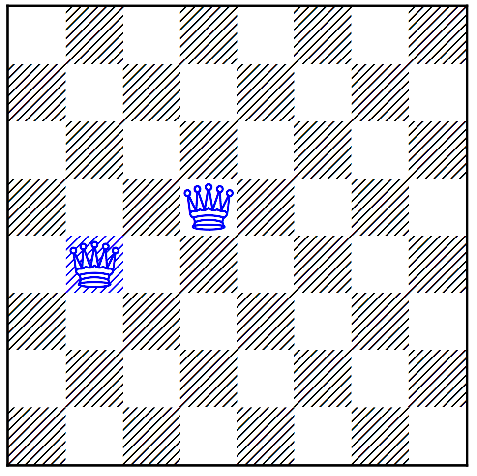
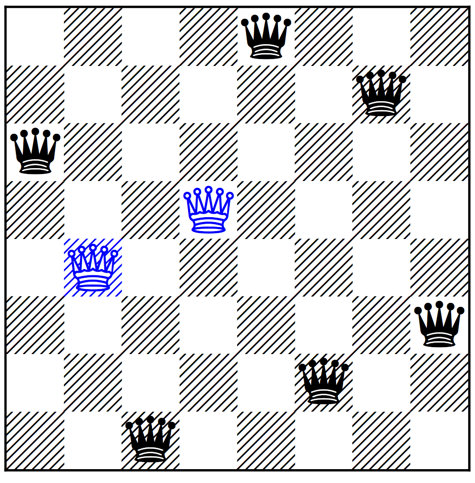
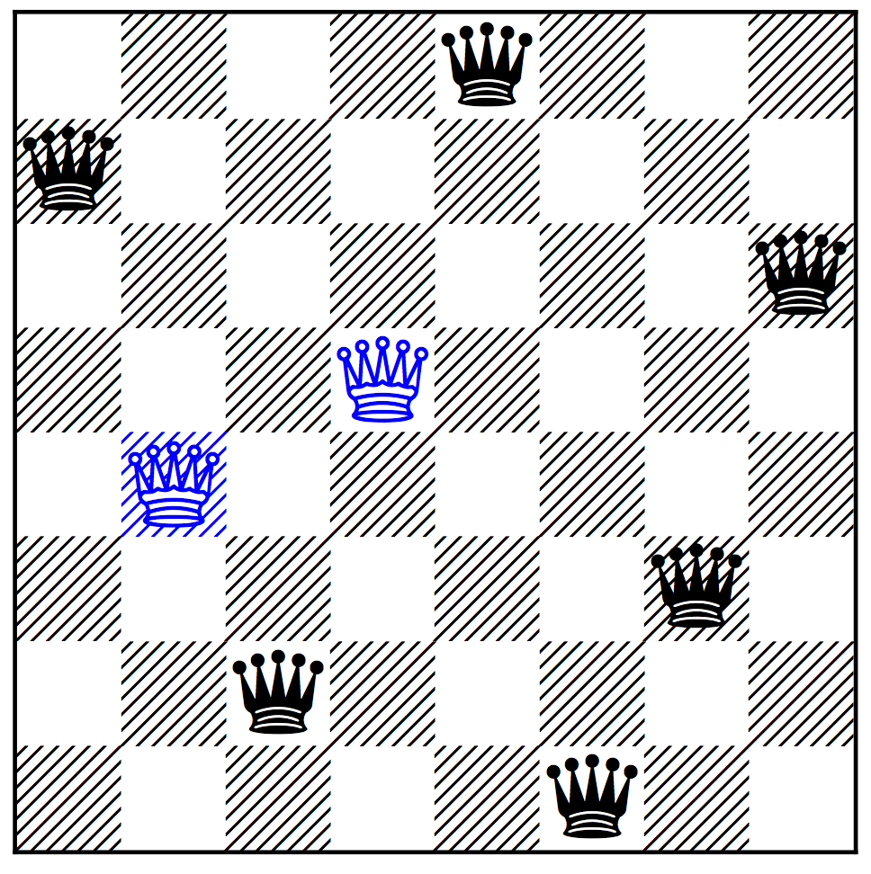

$n$-Queens Completion Problem
========

The {prob054} Problem, [prob054], suffers from the problem that its complexity is trivial as a decision problem.  
The n-Queens Completion and Blocked n-Queens problems are variants of {prob054} which have been proven to
be NP-Complete as decision problems and #P-Complete as counting problems.

<figure>
  
  <figcaption>An instance of n-Queens Completion from 1850</figcaption>
</figure>

For the $n$-Queens Completion Problem, as well as board size $n$, one is given some number of queens placed 
on the board already. The problem is to provide a solution to the $n$-Queens problem containing all those queens. I.e. a superset of the preplaced queens of size $n$ and with no two queens on the same row, column, or diagonal.  (If any two of the preplaced queens attack each other it is considered to be trivially unsolvable).

The image shows an example problem, originating in 1850 cite{Nauck1850a}.  Can you place the other 6 queens to give a solution to the 8-Queens problem?  And in how many ways is this possible?  The answers are shown below.

Excluded Diagonals $n$-Queens Problem
========

The Excluded Diagonals Problem is a closely related problem where, given an $n \times n$ board, only certain rows and columns are allowed and certain diagonals are excluded. 
For rows and columns, a subset of rows and columns are specified which are allowed. The subsets must be the same size.
A sum diagonal is the set of squares where the sum of the row and column indexes of the squares is constant.  A difference diagonal is the set of squares where the difference between the row and column indexes is constant.  
For the Excluded Diagonals Problem, we are given $n$ and a set of diagonals, each of which is either a sum diagonal or a difference diagonal. A solution is a set of queens with exactly one queen in each of the allowed rows and columns, and where where no queen is placed on one of the  
excluded diagonals.

Relation between the two problems
========

The two problems here are so similar it is best to think of them as the same problem, as processing to flip between them is very simple. 

To go from $n$-Queens Completion to Excluded Diagonals is very easy: simply allow only rows and columns with no queens preplaced, and exclude any diagonals (both sum and diagonal) on which there are preplaced queens.  

The other direction is more complex but still fast, following a construction in cite{nqueenscompletion}. It is implemented in the python files 
<a href="models/diagtoqueens.py.html">diagtoqueens.py</a> and 
<a href="models/queens-diag-transform.py.html">queens-diag-transform.py</a>.

Random Instance Generators
==========================

Python generators are available to implement the models from the paper cite{nqueenscompletion}. 
The generator for random placement of queens for of n-Queens Completion is not recommended as it does not seem to produce hard instances. 
<a href="data/queens-diag-gen.py.html">The generator for random Excluded Diagonals n-Queens instances</a>
does appear to generate hard instances.  

Note that the generator for Excluded Diagonals always allows all rows and columns, so those are not outputted. It also offsets the difference diagonals by n-1 so that all numbers are non-negative. Also it generates a maximal set of diagonals which retain the property that there are at least k squares left in each row and column (e.g. k=4). The generator is designed so that, if you want fewer diagonals than that maximal
number, e.g. $d$, you can simply take the first $d$ diagonals and get a probabilistically valid sample.

References
==========

The n-Queens Completion problem was proposed in 1850 cite{Nauck1850a}

The Excluded Diagonals Problem was proposed by cite{nqueenscompletion}

Both problems were proved NP-Complete and #P-Complete by cite{nqueenscompletion}

<figure>
  
  
  <figcaption>The Two Solutions to the n-Queens Completion from 1850</figcaption>
</figure>

