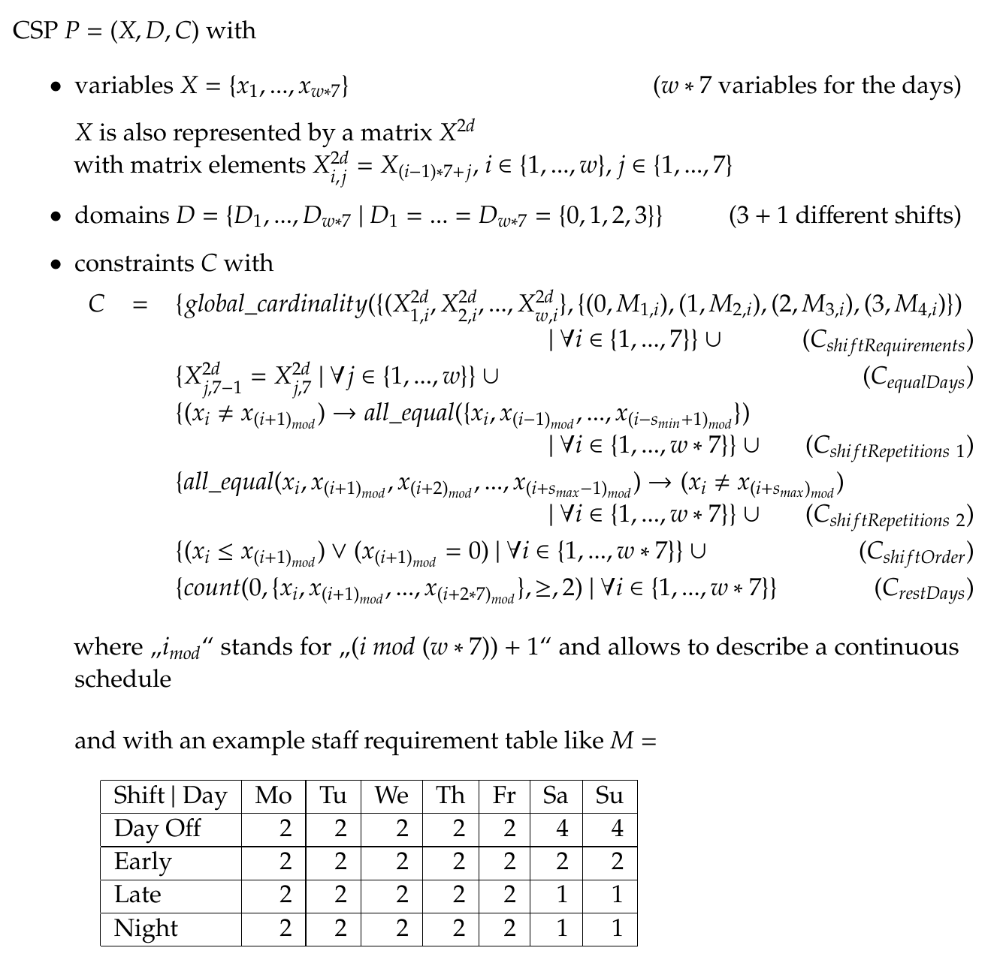

## Rotating Rostering Problem 
This problem is taken from real life rostering challenges (like nurse rostering). The task is it to find a
shift assignment for every employee for every day. A rotation system is used to decrease the size of the problem. Thus,
only the rostering for one employee is calculated and all other employees gain a rotated version of the rostering. So
Employee 2 has in the first week the rostering of Employee 1 in the second week. Employee 3 has in the first week the
rostering of Employee 2 in the second week and Employee 1 in the third week etc. See the following example for 4
employees:

|            |        |        |        |        |
|------------|--------|--------|--------|--------|
| Employee 1 | Week 1 | Week 2 | Week 3 | Week 4 |
| Employee 2 | Week 2 | Week 3 | Week 4 | Week 1 |
| Employee 3 | Week 3 | Week 4 | Week 1 | Week 2 |
| Employee 4 | Week 4 | Week 1 | Week 2 | Week 3 |

Thus, the number of employees is always also the number of weeks. Furthermore, it must be possible to have the shift
assignments of the first week (week1) follow after the last week (week4) to create a continuous rolling schedule.
Consider that every week in this example represents the shift assignment for 7 days, for example: week1 = Night, Day Off,
Day Off, Day Off, Early, Early, Early. Thus, the resulting rostering can be read in two ways. Reading a line shows the
rostering for one employee for all weeks. Reading a column (meaning a day of the week) shows the rostering for all
employees for one day. Further details and restrictions follow below.

### Definitions and restrictions

- let *w* in N be the number of weeks (and also the number of employees) we're planning for
  - ..be *x_1* to *x_(w\*7)* the variables for the CSP, i.e. the days
- there are 4 possible shifts: early = 1, late = 2 and night shift = 3 and day off (rest day) = 0 
   - ..resulting in the domains *D_1 = D_2 = … =  D_(w\*7) = {0,1,2,3}*
- *C_shiftRequirements*: for every weekday for each shift the number of required staff is provided (e.g. usually less
   staff is required on the weekend) see an example staff requirement matrix *M* below
- *C_shiftRepetitions*: for every shift type a maximum number of consecutive assignments to this shift is given to
   comply with work regulations, e.g. we restrict the general number of repetitions to *s_max* = 4. A number of minimal
   consecutive assignments is given as well to comply with work regulations, e.g. we demand at least two days in a row
   with the same shift *s_min* = 2
- *C_shiftOrder*: restricts the order of shifts. There is a forward rotating principle. This means, that after an early
   shift there can only follow a shift with the same or a higher value, or a rest shift (day off).
- *C_equalDays*: constrains that weekend days (Saturday and Sunday) always have the same shift
- *C_restDays*: at least 2 days must be rest days every 14 days.

These restrictions are either based on regulations or academic findings on good work practices.

A rostering instance can be described by Rostering-*w*-*M*-*s_min*-*s_max*, where

- *w* is the number of weeks
- *M* is a 4 times 7 matrix, including at *M_i,j* the needed employees for shift *(i-1)* and day *j* (shift types are 0-indexed, the matrix *M* is 1-indexed)
- *s_min* is the minimum number of days in a row with the same shift
- *s_max* is the maximum number of days in a row with the same shift

The following CSP P = (X, D, C) can describe the problem:

This represents an instance that covers 8 weeks with 8 employees, as can be calculated from the assignments to the
shifts in *M*.
