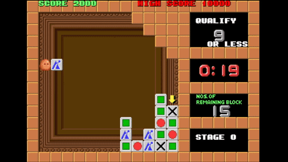
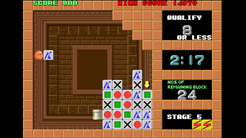

[Plotting](https://en.wikipedia.org/wiki/Plotting_(video_game)) is a tile-matching puzzle video game published by Taito. The objective of the game is to remove at least a certain number of coloured blocks from a grid by sequentially shooting blocks into the same grid. The interest and difficulty of Plotting is due to the complex transitions after every shot: various blocks are affected directly, while others can be indirectly affected by gravity.
 
Plotting is played by one agent with full information of the state, and the effects of each action are deterministic. The blocks can be shot either horizontally directly into the grid, or by shooting at the wall blocks above the grid, and bouncing down vertically onto the grid.

The rules for what happens when a block hits the wall or falls onto the floor are as follows:

* If it hits a wall as it is travelling horizontally, it falls vertically downwards. In a typical level, additional walls are arranged to facilitate hitting the blocks from above.
* If it falls onto the floor, it rebounds into the avatar’s hand.

The rules for a shot block `S` colliding with a block `B` in the grid are a bit more complex:

* If the first block `S` hits is of a different type from itself, `S` rebounds into the avatar’s hand and the grid is unchanged --- a null move.
    *  If `S` and `B` are of the same type, `B` is consumed and `S` continues to travel in the same direction. All blocks above `B` fall one grid cell each.
    *  If `S`, having already consumed a block of the same type, hits a block `B` of a different type, `S` replaces `B`, and `B` rebounds into the avatar’s hand.

A depiction of the general gameplay of the game

A vertical shot that affects a column

A vertical shot reaching the ground, and therefore keeping the same colour in the hand

A horizontal shot, depicting the effect of gravity

A horizontal shot, which arrives to the right wall and continues downwards

