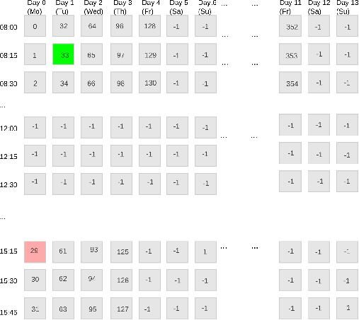

## Model Description

The **Medical Appointment Scheduling Problem (MASP)** focuses on assigning a set of medical resources at specific times to constitute a medical appointment for a given patient.

Given a set of medical resources, e.g., physicians with their current schedules represented as calendars (each with _M_ time slots per day), the MASP must satisfy the following constraints:

- Resources must have sufficient available time slots in their schedules to cover the required appointment duration.
- Time slots allocated to the appointment must be **sequential** (i.e., no gaps are allowed).
- The correct medical resource types must be chosen to serve the appointment's purpose. For example, a cardiologist is required for cardiological conditions.
- The appointment must not be scheduled on **undesired dates** specified by the patient.
- Patient preferences—such as preferred dates, physicians, weekdays, and times—should be respected as much as possible.

---

## Model Parameters

- **T = { τ₁, ..., τₗ }**: A set of required **resource types** for the appointment.  
  Example:  
  **T = { Cardiologist, Neurologist, CT_Room }**  
  means that the appointment must include a cardiologist, a neurologist, and a CT scan room.

- **_d_**: The required **duration** of the appointment in time slots.  
  Assuming a slot is 15 minutes long,  
  **_d = 4_** implies an appointment duration of 60 minutes (1 hour).

- **_Ud_** A set of undesired dates by patient.

- **_Pr_**: A set of **preferred resource identifiers** (e.g., preferred physicians) specified by the patient.

- **_Pd_**: A set of **preferred dates**, represented as column indices of the calendar matrix.

- A set of **preferred time slot specifications**. Each specification consists of:
    - Start slot index $s_p$ 
    - End slot index  $e_p$
    - Weekday index (0 = Monday, ..., 6 = Sunday) $p_w$

---

## Modelling

This section defines the **decision variables**, their **domains**, and the **constraints** governing the problem.

---

## Problem Domains

We define two types of integer domains:

- **Resource Identifier Domain (R)**: Divided into sub-domains **Rτ** for each **τ ∈ T**, depending on the resource type.  
  For instance, all cardiology physicians form a cardiology sub-domain.

- **Time Slot Identifier Domain**: Describes the available time slots of all resource calendars. Each slot is uniquely encoded by an identifier based on its start time and date. A time slot domain corresponding a resource calendar can be seen as 2D matrix as shown below. The columns represent scheduling days (dates) and the rows model time slots (in our example 32 slots per day). Slot identifiers help to cope with tracking resource availability and extracting time and day (and date) information. For example, slot identifier 33 corresponds to the second scheduling day (or date) $\lfloor \frac{33}{32} \rfloor$  = 1 (second calendar date) mod 7 = 1 (Tu). The time slot corresponds slot identifer 33 is $33 \quad mod \quad 32 = 1$ (time slot index) corresponding to the slot starting at 08:15. From all resource calendars, a globla shared calendar representing the calendar of the medical facility can be built to reflect the structure of the scheduling horizon within the medical facility.

In the modeling, we make use of slot identifiers and column/row indcies to express various time/date-related constraints. 

---

## Assumptions 

In the prototype model (Choco implementation), we assume the duration of each time slot is 15 minutes and the number of slots per each calendar day is $M =24$ slots. Moreover, we assume that all resources have the same availability, i.e., they share slot identifiers. Please also note that, resource calendars are unfolded into 1 D array with previously calculated slot identifiers. To teach yourself on constructing time slot identifiers, please check our reference published paper.

---

## Decision Variables

- **V = { x₁, ..., xₗ }**: A set of decision variables over domains **Rτ**, where **τ ∈ T**.  
  For example, if two cardiologists are needed, two variables over the cardiology domain are introduced.

- For each involved resource $z$ in resource domain, an auxiliary variable is declared:
  - **auxz ∈ Sz \ {–1}**,  
    where **Sz** is the calendar of resource **z** excluding unavailable slots (denoted by –1).  
    These track time slot allocations for that resource. Each auxiliary variable can be seen as the start slot of teh appointment nominated by the associated resource. The set of all auxuliary variables are indicated by $A = \{aux_1, \dots, aux_n\}$

- **N** decision variables for the **time slots** of the appointment:  
  **∀k ∈ {1, ..., N}**,  
  **tk ∈ Sg**,  
  where **Sg** is the global time slot domain (facility-wide calendar).

---

## Constraints

The model includes **hard constraints** (structural rules) and **soft constraints** (patient preferences).

### Hard Constraints

- **Distinct Resources**:  
  Resources allocated for the appointment must be different:
$$ 
  \texttt{AllDifferent}(\{x_1, x_2, \dots, x_l\}), \quad \forall\, \tau_i = \tau_j \in T
$$

- **Sequential Time Slots**:  
  Appointment time slots must be consecutive:
$$ 
  t_k = t_{k-1} + 1, \quad \forall k = 2, \dots, N
$$ 

- **Linking Constraint**:  
  Connects a resource assignment to the start time of the appointment:
$$
  (x_i \in R_\tau) \rightarrow (t_1 = \text{aux}_i)
$$ 

- **Eliminate undesired dates by patient**
This constraint is met when all resources do not match slots falling within the slots of the corresponding undeired dates. This constraint is expressed as. 
$$
\forall a \in A, \quad \forall d \in U_d:\quad
\left\lfloor \frac{\text{a}}{M} \right\rfloor \ne d
$$

### Soft Constraints

-  **Date Preference Violation**:  
  Date preference violation by one resouree occurs when a resource nominates a start  slot  falling outside of the slots describing the calendar date that preferred by patient. This can be expressed as:

$$
v_{\text{date}, \text{aux}} =
  \bigvee_{p \in P_d}
  \left(
    \left\lfloor \frac{\text{aux}}{M} \right\rfloor = \text{dateIndex}(p)
  \right) = 0
$$

Function $\textit{dateIndex}$ returns the date index corresponding to a give date $p$. The total number of violations over all resource calendars is:

$$
\sum_{a \in \mathcal{A}} v_{\text{date}, \text{a}} 
$$

 -  **Preferred Resource Violation**:

Let $x$ be a decison variable describing a resource that is desired to be assigned an identifier $P_r$  corresponding to a resource specified by the patient. The decision variables that should be assigned preffered resources denoted by $\mathcal{V'} \subset V$ . Then, the violation of thsi constraint occurs when the variable $x$ is assigned an identifier differs from those given by teh patient. this can be expressed as:

$$
v_\text{resource} =  {x \notin P_r}
$$

Then the total number of violations over all preferred resources is:

$$
\sum_{x \in \mathcal{V'}} v_{resource}(x)
$$

- **Preferred  weekday and time violation**

For a resource calendar $aux$ and weekday preference $p_d$, a violation occurs, when a resource nomninates a slot identifier  falling in the slots of the preferred weekday in that resource calendar. This can be described as follows:

$$
\text{weekDayMatch}_{aux,p_w} = \left\lfloor \frac{aux}{M} \right\rfloor \mod 7 = p_w 
$$

 Time slots (start and end) matching for one resource for the appointment  is expressed as 

$$
\text{timeMatch}_{aux,p} = (aux \mod M) \in [s_p, e_p] 
$$

A violation occurs when:
- Appointment is on the right day **AND**  Outside the preferred time window

$$
v_{aux,p} = weekDayMatch_{aux,p_w} \cdot  (1 - \text{timeMatch}_{aux,p} )
$$

Total violations over all calendars:

$$
\sum_{a \in \mathcal{A}} \sum_{p \in \mathcal{P}} v_{a,p}
$$

**Optimization Function**
 As the goal is to minimize the violation of patient preferences, we define the objective function as: 
 $$
\text{Minimize} \quad F = \sum_{a \in \mathcal{A}} v_{\text{date}, \text{a}}  + \sum_{x \in \mathcal{V'}} v_{resource}(x) + \sum_{a \in \mathcal{A}} \sum_{p \in \mathcal{P}} v_{a,p} 
 $$
